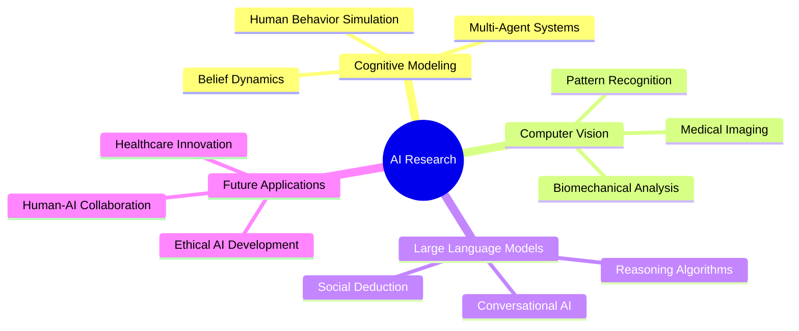

# <div align="center"> **ROHIT G. MAITY** </div>

<div align="center">
  
</div>

---

<div align="center">
  
###  **NEURAL NETWORK ARCHITECT** • **DATA SCIENTIST** • **AI RESEARCHER** 

[](https://maps.google.com/?q=Chicago,IL)
[](mailto:maityrohit99@gmail.com)
[](https://linkedin.com/in/rohit-maity)
[](https://github.com/rohitmaity)

</div>

---

## 🔮 **CURRENT FOCUS** 

```python
class RohitMaity:
    def __init__(self):
        self.current_position = "AI Researcher @ DePaul University"
        self.research_area = "Foot Posture Index Analysis"
        self.passion = ["Cognitive Modeling", "LLMs", "Computer Vision"]
        self.mission = "Bridging AI and Human Intelligence"
    
    def current_projects(self):
        return {
            "Social Deduction AI": "LLM-powered reasoning algorithms",
            "Foot Posture Research": "Advanced biomechanical analysis",
            "Multi-Agent Systems": "Cognitive modeling in games"
        }
```

---

## ⚡ **TECHNICAL ARSENAL**

<div align="center">

### 🧮 **CORE LANGUAGES**


### 🤖 **AI/ML FRAMEWORKS**


### 🔬 **SPECIALIZED TOOLS**


</div>

---

## 🛸 **PROJECT SHOWCASE**

<details>
<summary><b>🧠 Generative AI Text Summarization</b> | <i>State-of-the-art PEGASUS Implementation</i></summary>

```yaml
Technology Stack: PEGASUS Transformer, PyTorch, NLTK, GPU Acceleration
Dataset: SAMSum (16,300+ dialogues)
Performance: High ROUGE scores across all metrics
Innovation: 2x processing speed improvement with batch inference
Impact: Scalable abstractive summarization pipeline
```
</details>

<details>
<summary><b>🎮 Social Deduction AI</b> | <i>LLM-Powered Reasoning Algorithms</i></summary>

```yaml
Technology Stack: LLMs, Cognitive Models, Flask, FastAPI, Socket.IO
Complexity: 12+ character types, 6+ game phases
Architecture: Multi-agent belief dynamics modeling
Scale: 100+ concurrent sessions support
Research Areas: Game theory, Social neuroscience, Deception modeling
```
</details>

<details>
<summary><b>🔍 Medical Image Analysis</b> | <i>LIDC Dataset CT Scan Classification</i></summary>

```yaml
Technology Stack: CNNs, VAE, Statistical Analysis
Dataset: 2,250+ CT scan images
Discovery: 70% pattern recognition in spiculated nodules
Method: Pixel intensity distribution analysis
Application: AI-driven medical imaging diagnostics
```
</details>

---

## 📈 **GITHUB ANALYTICS**

<div align="center">
  


</div>

---

## 🎯 **RESEARCH INTERESTS & VISION**

<div align="center">



</div>

---

## 🌐 **CONNECT & COLLABORATE**

<div align="center">

### 💫 *"Building bridges between artificial and human intelligence"* 💫

[](https://your-portfolio.com)
[](https://scholar.google.com)
[](mailto:maityrohit99@gmail.com)

---


</div>

---

<div align="center">
  
</div>
